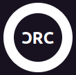

<link rel="stylesheet" type="text/css" href="https://fonts.googleapis.com/icon?family=Material+Icons">

<style>
/* #region layout */

:root
{
    font-family: "Ubuntu", sans-serif;
}

body > div
{
    background: #181220;

    align-items: center;
    display: flex;
    flex-flow: column nowrap;
}

header
{
    height: 30vh;
}

header + *
{
    height: 50vh;
}

footer
{
    height: 20vh;
}

/* #endregion layout */

/* #region header */

header > :only-child
{
    align-items: center;
    display: flex;
    justify-content: center;

    color: white;

    height: 100%;
}

/* #endregion pre */

/* #region footer */

footer > :only-child
{
    align-items: center;
    display: flex;
    justify-content: center;

    height: 100%;
}

footer :any-link
{
    color: white;

    align-items: center;
    display: flex;
    flex-flow: column nowrap;
    gap: 10px;

    text-decoration: none;
}

/* #endregion footer */
</style>



# Cassiano Castro

/* Computer Technician */

```c++
#include <iostream>

/**
 *
 */
int main(const int argc, const char** argv)
{
    std::cout << "Hello world!" << '\n';

    return 0;
}
```

<footer>
    <div>
    <a href="mailto:development.castro@gmail.com">
        <span class="material-icons md-24">mail</span>
        <span>development.castro@gmail.com</span>
    </a>
    </div>
</footer>

<!-- ### Hi there 👋 -->
<!--
**cassianocastro/cassianocastro** is a ✨ _special_ ✨ repository because its `README.md` (this file) appears on your GitHub profile.

Here are some ideas to get you started:

- 🔭 I’m currently working on ...
- 🌱 I’m currently learning ...
- 👯 I’m looking to collaborate on ...
- 🤔 I’m looking for help with ...
- 💬 Ask me about ...
- 📫 How to reach me: ...
- 😄 Pronouns: ...
- ⚡ Fun fact: ...
-->